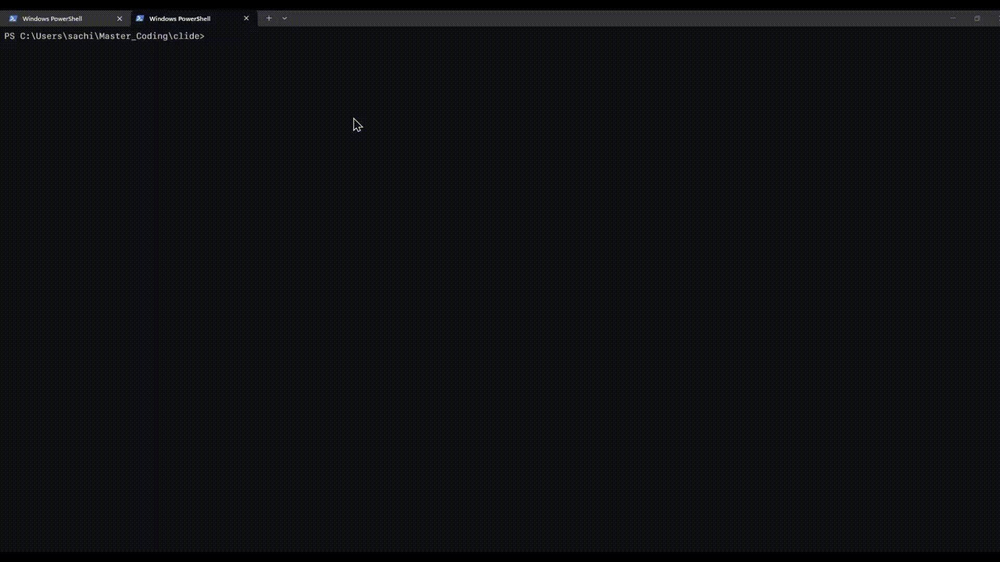

# Clide Desktop

A powerful desktop productivity suite with task management, calendar, TODO lists, and notes - all in one app.



## 🚀 Quick Start (No Installation Required!)

**The easiest way to use Clide:**

1. **Download** the `app/` folder from this repository
2. **Run** `app\Clide\Clide.exe`
3. **That's it!** No Java installation needed - everything is bundled.

The app runs completely offline and stores all your data locally.


## Features

### Tasks Management
- Create, update, delete tasks
- Toggle complete/incomplete status
- Filter tasks by `All`, `Active`, and `Completed`
- Search tasks with ranked matching (title prioritized over description)
- Due dates and descriptions

### Calendar View
- Month-view calendar showing tasks by due date
- Click dates to see tasks for that day
- Visual task count indicators
- Today/selected date highlighting

### TODO Lists
- Create multiple TODO lists
- Quick add/check/delete items
- Persistent checkboxes
- Organize tasks into separate lists

### Notes & Self-Chat
- Create timestamped notes
- Chat-style interface
- Quick note-taking and journaling
- Delete individual notes

**All data persists locally in H2 database (`data/taskdb`)**

## Stack

- Java 21+ (tested on Java 24 runtime)
- Maven
- JavaFX
- Spring Boot 3.4.x
- Spring Data JPA + H2
- Kotlin (search helper module)

## 💻 For Developers

### Running from Source

1. Install Java 21+ and Maven
2. From repo root, run:

```powershell
mvn clean test
mvn javafx:run
```

If `mvn` is not on your PATH, use:

```powershell
& 'C:\ProgramData\chocolatey\lib\maven\apache-maven-3.9.12\bin\mvn.cmd' clean test
& 'C:\ProgramData\chocolatey\lib\maven\apache-maven-3.9.12\bin\mvn.cmd' javafx:run
```

## 📦 Distribution

### Pre-built App (Recommended for Users)

The `app/Clide/` folder contains a ready-to-run Windows application:
- **No Java required** - JRE is bundled
- **No installation** - just download and run
- **Portable** - copy to USB drive or anywhere
- **Size**: ~100MB (includes everything needed)

**To distribute:**
1. Zip the `app/Clide/` folder
2. Share the zip file
3. Users extract and run `Clide.exe`

### Building from Source

To rebuild the application:

```powershell
.\build-exe.ps1
```

This creates `app\Clide\` - a portable application folder that bundles the JRE and all dependencies.

### Creating a Windows Installer (.exe)

To create a single-file installer instead of a portable app, see **[docs/INSTALLER.md](docs/INSTALLER.md)** for complete instructions.

**Quick summary:**
1. Install WiX Toolset: `winget install --id WiXToolset.WiX`
2. Update pom.xml (change type to EXE, add Windows options)
3. Run: `.\build-installer.ps1`

This creates `app\Clide-1.0.0.exe` - a professional installer with Start Menu integration, shortcuts, and uninstaller.

## Project Layout

```text
src/main/java/com/example/taskmanager
  ApplicationLauncher.java
  TaskManagerApplication.java
  domain/
  dto/
  repo/
  service/
  ui/
src/main/kotlin/com/example/taskmanager/search
  TaskSearch.kt
src/test/java/com/example/taskmanager
  integration/
  search/
  service/
  ui/
src/main/resources/application.yml
src/test/resources/application-test.yml
```

## Documentation

See `info/README.md` for a full set of guides:

- Setup and prerequisites
- End-user usage
- Development workflow
- Architecture
- Testing
- Troubleshooting

## Notes

- The app stores tasks in `data/taskdb.mv.db`.
- The first run may download dependencies and take longer.
- On some locked-down environments, JavaFX may log cache warnings; app behavior is usually unaffected.
